# NYC Airbnb Analytical Dashboard

Course project for **Data Visualization**. The project builds an interactive React + D3.js dashboard for exploring NYC Airbnb listings, prices, occupancy, review quality, host behavior, and customer experience signals.

The dashboard is driven by the domain tasks defined in the midterm report. Each view is implemented with D3.js and selected to match a suitable visualization idiom for the analytical question.

## Dashboard Preview

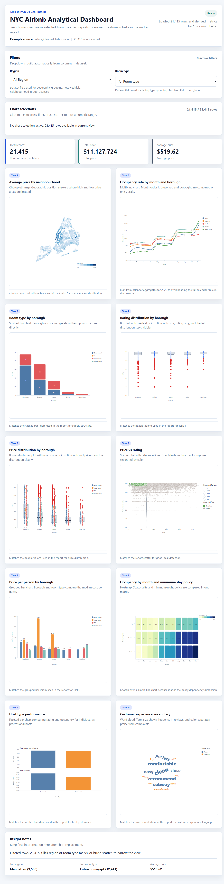

## Main Features

- Task-driven dashboard for 10 visualization domain tasks.
- Interactive D3.js charts with hover, selection, highlight, zoom/pan, and filtering where appropriate.
- React state management for filters, KPI cards, chart selections, and insight summaries.
- Local CSV and GeoJSON data loading from the `data/` directory.
- Derived metrics generated from raw listings, calendar, reviews, and neighbourhood files.
- Static web app that can be run locally with Vite.

## Chart Gallery

| Task | Visualization | Preview |
| --- | --- | --- |
| Task 1 | Average price by neighbourhood map | 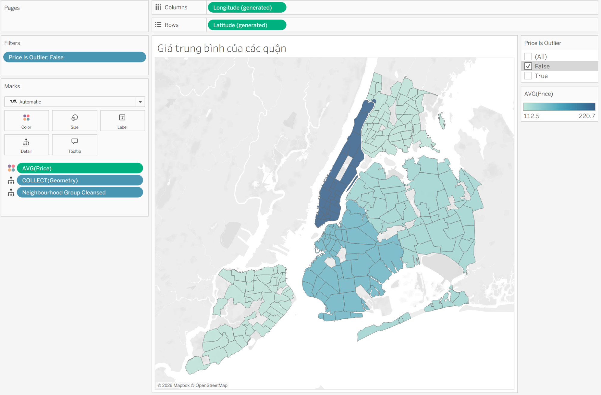 |
| Task 2 | Occupancy trend by month and borough | 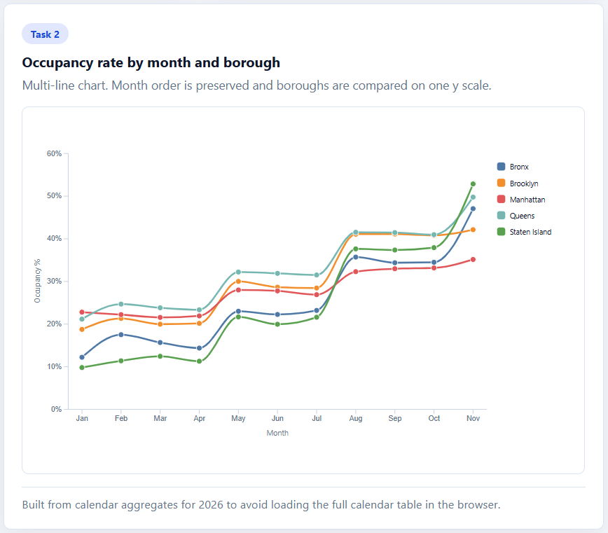 |
| Task 3 | Room type structure by borough | 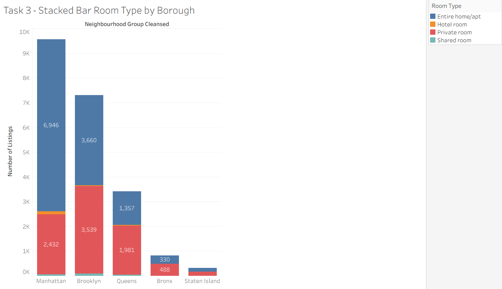 |
| Task 4 | Rating distribution by borough | 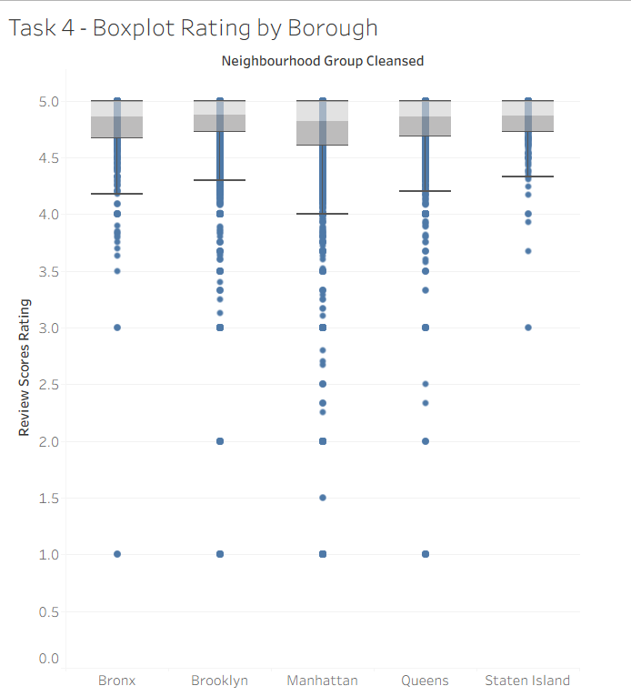 |
| Task 5 | Price distribution by borough | 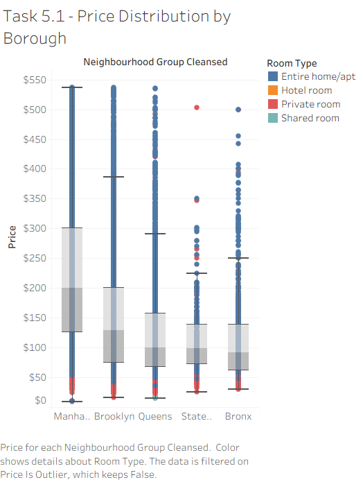 |
| Task 6 | Price vs rating good-deal detection | 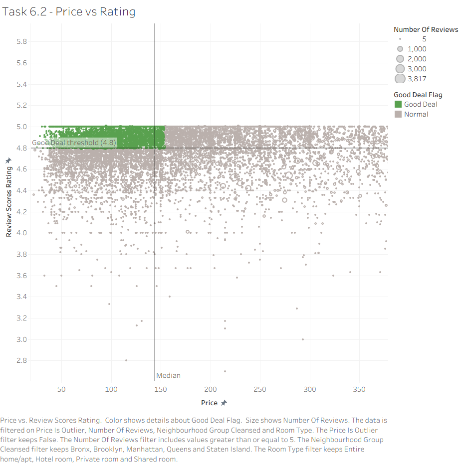 |
| Task 7 | Price per person by borough and room type | 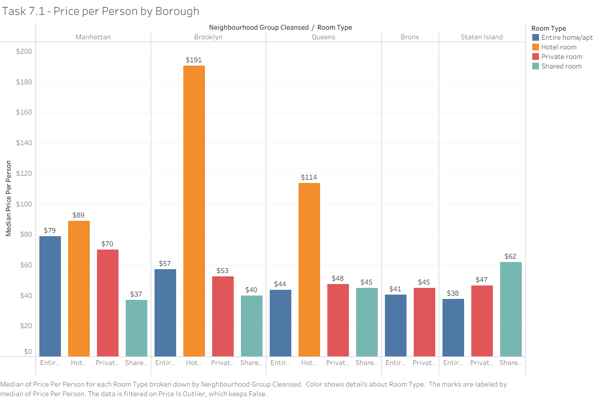 |
| Task 8 | Occupancy by month and minimum-stay policy | 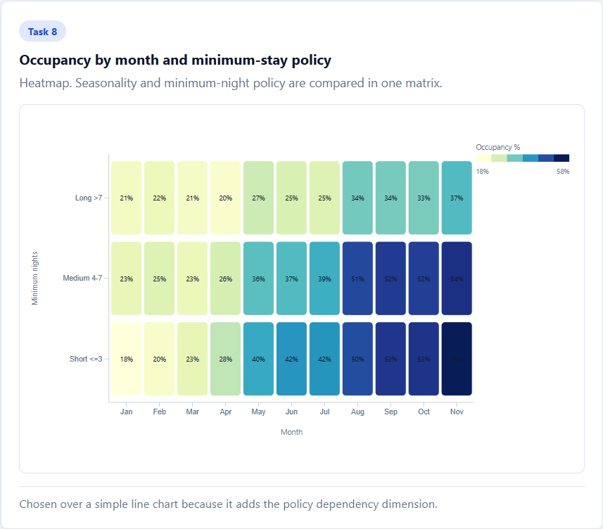 |
| Task 9 | Host type performance comparison | 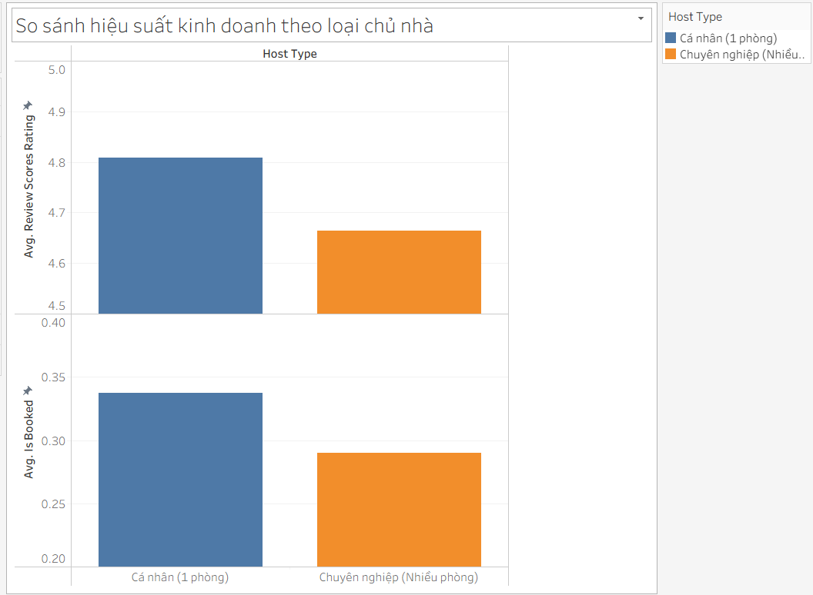 |
| Task 10 | Customer experience vocabulary | 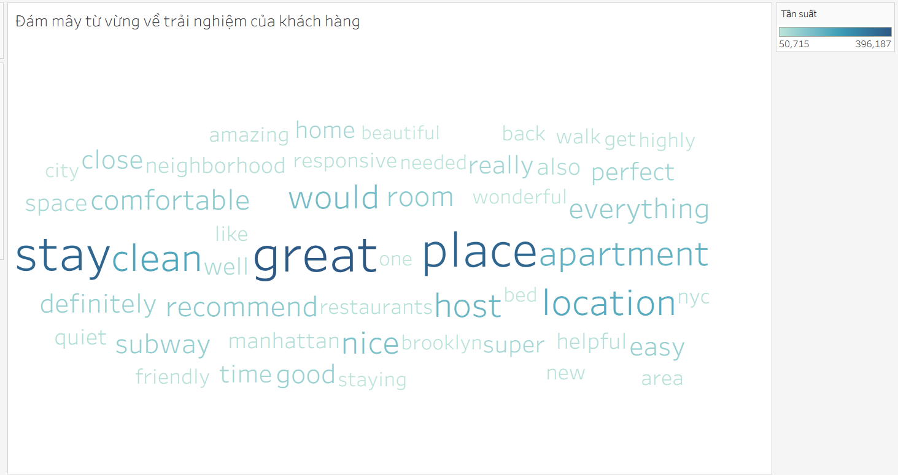 |

## Tech Stack

- React
- D3.js
- Vite
- JavaScript
- HTML/CSS

No external charting library is used. Chart rendering and interaction logic are implemented with D3.js.

## Project Structure

```text
d3-dashboard/
├── data/                         # Raw CSV and GeoJSON files
├── docs/                         # Reports, figures, and documentation assets
├── scripts/
│   ├── download-data.js           # Download raw data if missing
│   └── build-derived-data.js      # Generate compact derived metrics
├── src/
│   ├── components/                # Dashboard UI and chart components
│   ├── config/                    # Field names, filters, chart definitions
│   ├── data/                      # Derived metrics used by the dashboard
│   ├── hooks/                     # Data loading hooks
│   ├── styles/                    # Global dashboard styles
│   └── utils/                     # Data parsing, aggregation, formatting
├── index.html
├── package.json
└── vite.config.js
```

## Data

The dashboard expects these raw files in `data/`:

- `cleaned_listings.csv`
- `cleaned_reviews.csv`
- `cleaned_calendar.csv`
- `neighbourhoods.geojson`

After `npm install`, the project automatically checks whether these files exist. If they are missing, it downloads `data.zip` and extracts the expected files into `data/`.

The dashboard also uses:

```text
src/data/derivedMetrics.json
```

Regenerate this file after changing raw data or aggregation logic.

## Run Locally

```bash
npm install
npm run dev
```

Open:

```text
http://127.0.0.1:5173/
```

## Useful Scripts

```bash
npm run download-data
```

Download raw data into `data/` if it is missing.

```bash
npm run build-derived-data
```

Regenerate derived metrics for charts that should not process full raw tables in the browser.

```bash
npm run setup-data
```

Download raw data and regenerate derived metrics.

```bash
npm run build
```

Create a production build.

```bash
npm run preview
```

Preview the production build locally.

## Implementation Notes

- Main dashboard state is managed in `src/App.jsx`.
- Chart definitions and field mappings are centralized in `src/config/dashboardConfig.js`.
- D3 chart rendering is implemented in `src/components/charts/InteractiveChart.jsx`.
- Data parsing, filtering, KPI computation, and insight summaries are implemented in `src/utils/`.
- Large raw files are kept outside the browser bundle. Vite serves the local `data/` folder during development.

## Related Documents

- Source code guide: `SOURCE_CODE_GUIDE.md`
- LaTeX report source: `docs/report_latex/`
- Report figures: `docs/report_latex/charts/`
